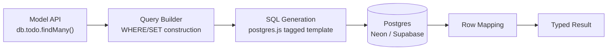
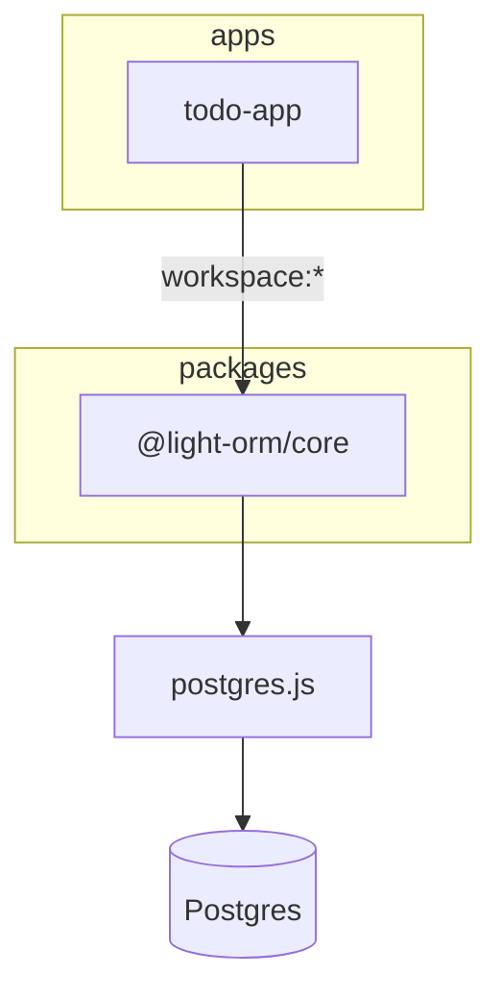
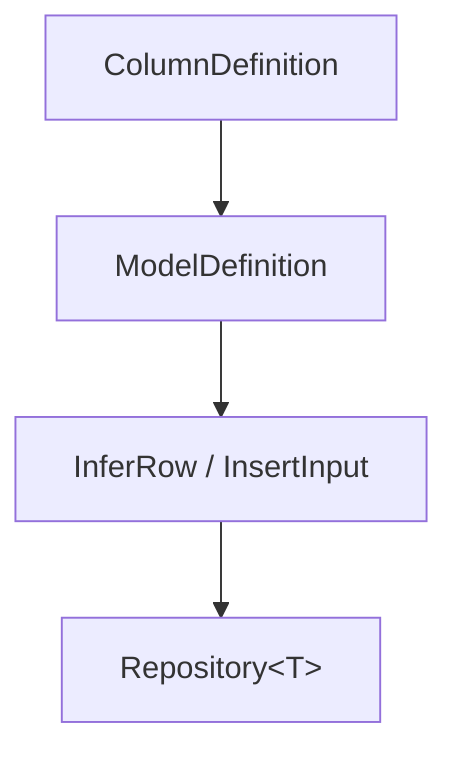

# Architecture & Design

## ORM Design

The `@light-orm/core` is a lightweight, type-safe Object Relational Mapper built on top of `postgres.js`. It adopts a functional, minimal configuration API designed for simplicity and strict type safety.

The `defineModel` function allows you to map database schema to TypeScript types:
- **Columns**: Defined via phantom types in `ColumnDefinition`.
- **Client Mapping**: When `createClient` is instantiated, it converts each defined model into a `Repository` containing strict generic typings. 
- **Query Execution**: `client.ts` uses `postgres.js` tagged templates to dynamically and safely bind parameterized values during execution, effectively nullifying SQL string concatenation vulnerabilities.

### Query Flow

## Package Dependencies

The project enforces a strict one-directional workspace boundary. The Next.js application imports the ORM purely as an npm package via its public exports map.

## TypeScript Inference Design

The Type System uses recursive generic types to accurately map abstract DSL column definitions into precise runtime TypeScript interfaces:

- The generic `InsertInput` explicitly forces `id` to be optional on input, bypassing boilerplate ID handling on entity insertion.
- Missing or incorrectly typed fields trigger immediate static errors.

## Limitations

- **WHERE Filters**: `where` supports equality filters only, combined with `AND`. No `OR`, no `IN`, no comparison operators, no nested/relational filters.
- **Naming Conventions**: Table names are passed explicitly without pluralization.
- **Numbers**: `int4` (INTEGER) is mandated for numerics. `int8` (bigint) natively returns Javascript `BigInt`, which escapes the standard `number()` bounds of this light ORM iteration.
- **No Migrations**: Schema updates are managed via manual DDL.

## Design Decisions

1. **`postgres.js` instance configuration**: Configured with `{ prepare: false }` to natively support transaction poolers out of the box (e.g. Supabase, Neon), avoiding the pgbouncer prepared statement trap.
2. **Dynamic WHERE Clauses**: The WHERE and SET clauses are aggregated through `.reduce` mapped against `sql` tagged template literals ensuring parameterized safety natively out of the library's design.
3. **Workspace Exports Strategy**: To treat `@light-orm/core` like a real npm package, `tsup` creates a standard bundle. The Next.js dev server explicitly points to this bundle rather than the ORM source code directly. This forces strict workspace boundaries but necessitates `concurrently` (or concurrent pnpm threads) during development (`tsup --watch` + `next dev`).
